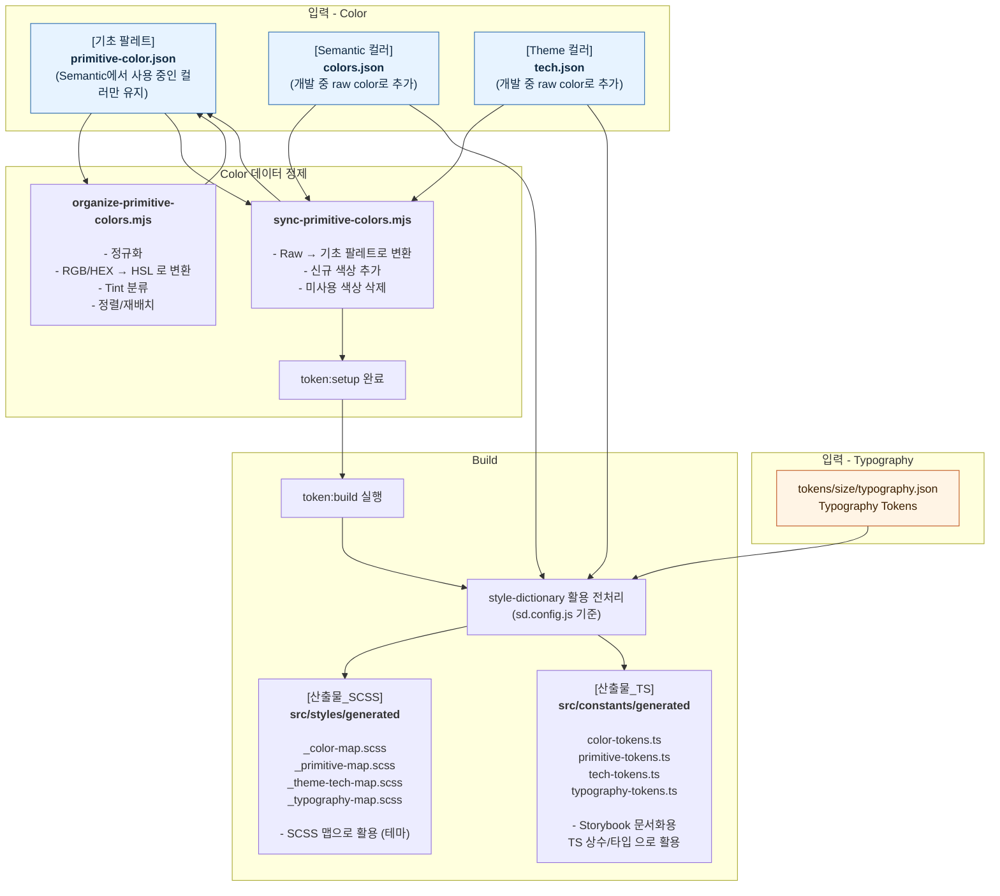
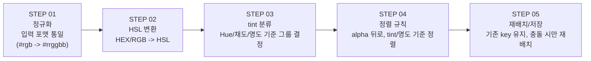

# UI System Guide

- `Storybook` 중심 검증 워크플로우 + `SCSS`/`Style Dictionary` 기반 토큰 자동화
- `React` + `TypeScript` UI 시스템 템플릿
- 실무에서 가장 자주 쓰는 43개 컴포넌트를 케이스별 스토리로 아카이빙
- 웹 접근성 기본값 설계: `컬러 대비` + `키보드 포커스/포커스 트랩`
- `Light/Dark` 확장 테마 컬러 시스템
- `react-i18next` 기반 `다국어(한국어/일본어/영어)` 지원
- Storybook a11y/인터랙션 테스트 지원(Axe 애드온 + Vitest 연동)
- 단일 토큰 소스 → SCSS/TS 산출물 자동 생성
- Datepicker 컴포넌트 공휴일 데이터 연동(공공데이터 포털: 한국천문연구원 특일 정보)

<br/>

## 배포/링크

- Storybook(Chromatic): <a href="https://main--6969cd54eb28cb3e2b57b769.chromatic.com/?path=/docs/introduction--docs" target="_blank" rel="noopener noreferrer">
  🔗 https://main--6969cd54eb28cb3e2b57b769.chromatic.com/?path=/docs/introduction--docs
  </a>
- main 브랜치 push 시 GitHub Actions 워크플로우로 자동 배포

<br/>

## 작업 배경

- 반복되는 컴포넌트 패턴과 네이밍 논의를 시스템화하기 위해 시작.
- Semantic/Primitive 컬러 관리의 충돌을 자동화 파이프라인으로 해결.
- 색상 추가/삭제가 잦은 환경에서도 안정적인 테마 확장을 보장.
- 다국어/테마/a11y 테스트를 Storybook에서 일괄 검증할 수 있는 구조 필요.

<br/>

## 기술 스택

| 도구              | 버전       | 선택 이유                                      | 실제 효과                              |
| ----------------- | ---------- | ---------------------------------------------- | -------------------------------------- |
| Node.js           | `v20.19.2` | 최신 툴체인을 안정적으로 지원하는 LTS 런타임   | 빌드 및 개발 환경 안정성 확보          |
| React / React DOM | `v19.2.0`  | 최신 React 기반 컴포넌트 설계                  | 일관된 컴포넌트 구조 유지              |
| TypeScript        | `v5.9.3`   | 컴포넌트 인터페이스를 명확히 정의              | 설계 의도에 맞는 사용 유도 및 DX 향상  |
| SCSS (Dart Sass)  | `v1.93.3`  | 변수·믹스인 기반 구조적 스타일링               | 테마 확장과 유지보수 용이              |
| pnpm              | `v9.5.0`   | 효율적인 의존성 관리                           | 설치 속도 개선 및 디스크 절약          |
| Vite              | `v7.2.2`   | 빠른 개발 서버와 HMR                           | 개발 피드백 속도 향상                  |
| style-dictionary  | `v5.1.3`   | 디자인 토큰 단일 소스 관리                     | 토큰 변경 시 자동 반영                 |
| Storybook         | `v10.1.11` | 컴포넌트 문서화 및 시각적 검증                 | 협업 효율 및 사용 가이드 강화          |
| Vitest            | `v3.2.4`   | Storybook 인터랙션/단위 테스트 실행            | UI 동작 검증 및 회귀 방지              |
| Chromatic         | `v11.29.0` | Storybook 배포 도구로 사용, 빠른 퍼블리싱 목적 | 빌드 후 즉시 공유 가능한 스토리북 배포 |
| GitHub Actions    | `workflow` | main 브랜치 push 시 자동 배포 워크플로우 실행  | 명령 없이 스토리북 배포 자동화         |

<br/>

## [Vitest] 테스트 결과

Vitest를 통해 다양한 컴포넌트 시나리오를 한 번에 검증하고, 회귀를 빠르게 확인할 수 있습니다.  
검증 기준은 Storybook 스토리의 인터랙션(클릭/키보드) 후 DOM 상태, 접근성 속성, 이벤트 동작이 기대값과 일치하는지 여부입니다. <br/><br/>


<br/>

## [Storybook] 테마 확인

상단 테마 토글을 찾아 클릭하여 라이트 모드와 다크모드를 변경하여 컴포넌트 스토리를 확인합니다.


<br/>

## [Storybook] 다국어 확인

상단 다국어 토글을 찾아 클릭하여 한국어, 영어, 일본어로 변경하여 컴포넌트 스토리를 확인합니다.


<br/>

## [Storybook] 키보드 포커스/포커스 트랩 확인

모든 컴포넌트에 키보드 포커스 이동과 포커스 트랩 처리를 적용했습니다.  
탭 이동 중에도 포커스가 사라지지 않고 안전하게 유지되는지 확인할 수 있습니다.


<br/>

## [전처리] 디자인 토큰 (Color/Typography) 파이프라인

전체 디자인 토큰 파이프라인의 `입력` → `데이터 정제` → `빌드` → `산출` 흐름을 요약한 다이어그램입니다.

- **단일 소스**: `tokens/` JSON을 기준으로 모든 산출물을 생성합니다.
- **역할 분리**: 의미(semantic)와 원색(primitive)을 분리해 재사용성과 일관성을 확보합니다.
- **동기화 단계**: `token:setup`에서 정리/추가/정렬을 자동화합니다.
- **다중 출력**: Style Dictionary가 동일 규칙으로 SCSS/TS 등 다양한 포맷을 생성합니다.
- **확장성**: 테마가 늘어나도 동일 규칙으로 자동 확장됩니다.

<br/>



<br/>
<br/>
<br/>

## [전처리] 컬러 토큰 추출 & 동기화 자동화 (5단계)

Primitive 컬러가 늘어나도 규칙과 일관성이 유지되도록 정렬·분류·재배치 과정을 자동화하려는 목적에서 만들었습니다. <br/> <br/>
추출된 토큰으로 구성한 색상은 스토리북에서 확인할 수 있습니다. <br/>
<a href="https://main--6969cd54eb28cb3e2b57b769.chromatic.com/?path=/docs/tokens-colors-primitive--docs" target="_blank" rel="noopener noreferrer">
🔗 https://main--6969cd54eb28cb3e2b57b769.chromatic.com/?path=/docs/tokens-colors-primitive--docs
</a>



<br/>

### STEP 01. 정규화

`tokens/color/colors.json`과 `tokens/color/themes/tech.json`은 개발자가 색상을 직접 입력하는 영역입니다. <br/>
이 단계에서는 시맨틱 컬러 JSON의 raw 값(HEX/RGB)을 읽어 비교 가능한 포맷으로 정규화합니다.

```js
normalizeColor('#abc'); // -> #aabbcc
normalizeColor('#abcd'); // -> #aabbccdd
```

<br/>

### STEP 02. HSL 변환

정규화된 raw 색상값(HEX/RGB)을 HSL(Hue/채도/명도)로 변환해 분류·정렬 기준을 만듭니다.  
HSL은 색상(Hue), 채도(Saturation), 명도(Lightness)로 구성된 모델이며, 사람이 인지하는 색상 축에 가까워 분류에 유리합니다.

```js
let r, g, b;
if (val.startsWith('#')) {
  r = parseInt(val.slice(1, 3), 16);
  g = parseInt(val.slice(3, 5), 16);
  b = parseInt(val.slice(5, 7), 16);
} else {
  const m = val.match(/[\d.]+/g);
  [r, g, b] = m.slice(0, 3).map(Number);
}
const { h, s, l } = rgbToHsl(r, g, b);
// 예: #60a5fa -> r:96 g:165 b:250 -> h: 210, s: 93, l: 68
```

<br/>

### STEP 03. tint 분류

HSL 값을 기준으로 색상군(tint)을 결정합니다.  
이 tint 값이 이후 primitive 그룹/키 이름의 기준이 됩니다.

```js
function getTintName(h, s, l) {
  if (s <= 2.5 || l >= 99.5 || l <= 0.5) return 'gray';
  if (h >= 170 && h < 260 && s < 45) return 'slate-blue';
  if (h >= 345 || h < 11) return 'red';
  if (h >= 11 && h < 45) return 'orange';
  if (h >= 45 && h < 65) return 'yellow';
  if (h >= 65 && h < 170) return 'green';
  if (h >= 170 && h < 205) return 'cyan';
  if (h >= 205 && h < 225) return 'sky';
  if (h >= 225 && h < 245) return 'blue';
  if (h >= 245 && h < 270) return 'indigo';
  if (h >= 270 && h < 310) return 'purple';
  if (h >= 310 && h < 345) return 'pink';
  return 'etc';
}

const tint = getTintName(h, s, l); // gray, slate-blue, blue, purple ...
```

<br/>

### STEP 04. 정렬 규칙

알파(투명) 컬러를 맨 뒤로 보내고, tint → 명도(L) 순으로 정렬합니다. <br/>
불투명한 색상과 투명한 색상을 분리하여 관리할 수 있습니다.

```js
allTokens.sort((a, b) => {
  const isAlphaA = a.a < 1;
  const isAlphaB = b.a < 1;
  if (isAlphaA !== isAlphaB) return isAlphaA ? 1 : -1;
  if (a.tint !== b.tint) return groupOrder.indexOf(a.tint) - groupOrder.indexOf(b.tint);
  if (Math.abs(b.l - a.l) > 0.01) return b.l - a.l;
  return a.a - b.a;
});
// 예: 같은 tint라면 밝은 컬러가 먼저 정렬됨 (L 높은 값 우선)
// 예: alpha 컬러는 항상 뒤쪽으로 정렬
```

<br/>

### STEP 05. 재배치/저장

기존 group/key를 최대한 유지하고, 충돌 시에만 +10 스텝으로 안전하게 재배치합니다.  
즉, 어떤 색상이 들어와도 변수 키가 겹치지 않고 고유한 값을 유지합니다.

```js
let finalKey = key;
let current = parseInt(key.split('-').pop(), 10) || 50;
while (organized.primitive[groupName][finalKey]) {
  current += 10;
  finalKey = isAlpha ? `${item.tint}-${current}` : `${current}`;
}
// 예: gray.500 충돌 -> gray.510
// 예: alpha-sky-620 충돌 -> alpha-sky-630
```

<br/>
<br/>
<br/>

## [Storybook] 컴포넌트 목록

- Atoms(단일 기능), Molecules(조합), Organisms(복합 레이아웃)로 분류
- 분류 기준: 역할 단위(Atoms) → 조합 단위(Molecules) → 화면/레이아웃 단위(Organisms)

### Atoms (단일 기능)

가장 작은 UI 단위로 재사용 가능한 단일 역할 컴포넌트입니다.

<table width="100%">
  <thead>
    <tr>
      <th>컴포넌트</th>
      <th>상세</th>
      <th>용도</th>
    </tr>
  </thead>
  <tbody>
    <tr><td><a href="https://main--6969cd54eb28cb3e2b57b769.chromatic.com/?path=/docs/ui-atoms-badge--docs" target="_blank" rel="noopener noreferrer">🔗 Badge</a></td><td></td><td>상태/카테고리 라벨</td></tr>
    <tr><td><a href="https://main--6969cd54eb28cb3e2b57b769.chromatic.com/?path=/docs/ui-atoms-checkbox--docs" target="_blank" rel="noopener noreferrer">🔗 Checkbox</a></td><td></td><td>다중 선택 입력</td></tr>
    <tr><td><a href="https://main--6969cd54eb28cb3e2b57b769.chromatic.com/?path=/docs/ui-atoms-radio--docs" target="_blank" rel="noopener noreferrer">🔗 Radio</a></td><td></td><td>단일 선택 입력</td></tr>
    <tr><td><a href="https://main--6969cd54eb28cb3e2b57b769.chromatic.com/?path=/docs/ui-atoms-label--docs" target="_blank" rel="noopener noreferrer">🔗 Label</a></td><td></td><td>폼 라벨/캡션</td></tr>
    <tr><td><a href="https://main--6969cd54eb28cb3e2b57b769.chromatic.com/?path=/docs/ui-atoms-skeleton--docs" target="_blank" rel="noopener noreferrer">🔗 Skeleton</a></td><td></td><td>로딩 스켈레톤</td></tr>
    <tr><td><a href="https://main--6969cd54eb28cb3e2b57b769.chromatic.com/?path=/docs/ui-atoms-spinner-ringspinner--docs" target="_blank" rel="noopener noreferrer">🔗 Spinner</a></td><td>RingSpinner</td><td>로딩 인디케이터</td></tr>
    <tr><td><a href="https://main--6969cd54eb28cb3e2b57b769.chromatic.com/?path=/docs/ui-atoms-tag--docs" target="_blank" rel="noopener noreferrer">🔗 Tag</a></td><td></td><td>키워드/속성 표시</td></tr>
    <tr><td>Textarea</td><td><a href="https://main--6969cd54eb28cb3e2b57b769.chromatic.com/?path=/docs/ui-atoms-textarea-solid--docs" target="_blank" rel="noopener noreferrer">🔗 Solid</a>, <a href="https://main--6969cd54eb28cb3e2b57b769.chromatic.com/?path=/docs/ui-atoms-textarea-outline--docs" target="_blank" rel="noopener noreferrer">🔗 Outline</a></td><td>멀티라인 입력</td></tr>
    <tr><td><a href="https://main--6969cd54eb28cb3e2b57b769.chromatic.com/?path=/docs/ui-atoms-tooltip--docs" target="_blank" rel="noopener noreferrer">🔗 Tooltip</a></td><td></td><td>보조 설명/힌트</td></tr>
  </tbody>
</table>

### Molecules (조합)

Atoms를 조합해 하나의 입력/동작 흐름을 완성하는 단위입니다.

<table width="100%">
  <thead>
    <tr>
      <th>컴포넌트</th>
      <th>상세</th>
      <th>용도</th>
    </tr>
  </thead>
  <tbody>
    <tr><td>Button</td><td><a href="https://main--6969cd54eb28cb3e2b57b769.chromatic.com/?path=/docs/ui-molecules-button-solid--docs" target="_blank" rel="noopener noreferrer">🔗 Solid</a>, <a href="https://main--6969cd54eb28cb3e2b57b769.chromatic.com/?path=/docs/ui-molecules-button-outline--docs" target="_blank" rel="noopener noreferrer">🔗 Outline</a>, <a href="https://main--6969cd54eb28cb3e2b57b769.chromatic.com/?path=/docs/ui-molecules-button-ghost--docs" target="_blank" rel="noopener noreferrer">🔗 Ghost</a>, <a href="https://main--6969cd54eb28cb3e2b57b769.chromatic.com/?path=/docs/ui-molecules-button-iconbutton-solid--docs" target="_blank" rel="noopener noreferrer">🔗 IconButton</a>, <a href="https://main--6969cd54eb28cb3e2b57b769.chromatic.com/?path=/docs/ui-molecules-button-linkbutton--docs" target="_blank" rel="noopener noreferrer">🔗 LinkButton</a></td><td>기본 액션 버튼</td></tr>
    <tr><td><a href="https://main--6969cd54eb28cb3e2b57b769.chromatic.com/?path=/docs/ui-molecules-button-buttongroup--docs" target="_blank" rel="noopener noreferrer">🔗 ButtonGroup</a></td><td></td><td>버튼 정렬/그룹화</td></tr>
    <tr><td><a href="https://main--6969cd54eb28cb3e2b57b769.chromatic.com/?path=/docs/ui-molecules-accordion--docs" target="_blank" rel="noopener noreferrer">🔗 Accordion</a></td><td></td><td>섹션 접기/펼치기</td></tr>
    <tr><td><a href="https://main--6969cd54eb28cb3e2b57b769.chromatic.com/?path=/docs/ui-molecules-avatar--docs" target="_blank" rel="noopener noreferrer">🔗 Avatar</a></td><td></td><td>사용자 프로필 표시</td></tr>
    <tr><td><a href="https://main--6969cd54eb28cb3e2b57b769.chromatic.com/?path=/docs/ui-molecules-breadcrumbs--docs" target="_blank" rel="noopener noreferrer">🔗 Breadcrumbs</a></td><td></td><td>경로/위치 표시</td></tr>
    <tr><td><a href="https://main--6969cd54eb28cb3e2b57b769.chromatic.com/?path=/docs/ui-molecules-chip--docs" target="_blank" rel="noopener noreferrer">🔗 Chip</a></td><td></td><td>필터/선택 상태 표시</td></tr>
    <tr><td>Combobox</td><td><a href="https://main--6969cd54eb28cb3e2b57b769.chromatic.com/?path=/docs/ui-molecules-combobox-autocomplete--docs" target="_blank" rel="noopener noreferrer">🔗 AutoComplete</a>, <a href="https://main--6969cd54eb28cb3e2b57b769.chromatic.com/?path=/docs/ui-molecules-combobox-searchbar--docs" target="_blank" rel="noopener noreferrer">🔗 Searchbar</a></td><td>입력+옵션 검색 선택</td></tr>
    <tr><td><a href="https://main--6969cd54eb28cb3e2b57b769.chromatic.com/?path=/docs/ui-molecules-controlgroup--docs" target="_blank" rel="noopener noreferrer">🔗 ControlGroup</a></td><td></td><td>라디오/체크 옵션 그룹</td></tr>
    <tr><td><a href="https://main--6969cd54eb28cb3e2b57b769.chromatic.com/?path=/docs/ui-molecules-datepicker--docs" target="_blank" rel="noopener noreferrer">🔗 Datepicker</a></td><td></td><td>날짜 선택</td></tr>
    <tr><td><a href="https://main--6969cd54eb28cb3e2b57b769.chromatic.com/?path=/docs/ui-molecules-switch--docs" target="_blank" rel="noopener noreferrer">🔗 Switch</a></td><td></td><td>온/오프 토글</td></tr>
    <tr><td>Input</td><td><a href="https://main--6969cd54eb28cb3e2b57b769.chromatic.com/?path=/docs/ui-molecules-input-solid--docs" target="_blank" rel="noopener noreferrer">🔗 Solid</a>, <a href="https://main--6969cd54eb28cb3e2b57b769.chromatic.com/?path=/docs/ui-molecules-input-outline--docs" target="_blank" rel="noopener noreferrer">🔗 Outline</a></td><td>단일 텍스트 입력</td></tr>
    <tr><td><a href="https://main--6969cd54eb28cb3e2b57b769.chromatic.com/?path=/docs/ui-molecules-formfield--docs" target="_blank" rel="noopener noreferrer">🔗 FormField</a></td><td></td><td>입력 + 라벨 + 메시지</td></tr>
    <tr><td><a href="https://main--6969cd54eb28cb3e2b57b769.chromatic.com/?path=/docs/ui-molecules-formfieldset--docs" target="_blank" rel="noopener noreferrer">🔗 FormFieldset</a></td><td></td><td>폼 섹션 그룹</td></tr>
    <tr><td><a href="https://main--6969cd54eb28cb3e2b57b769.chromatic.com/?path=/docs/ui-molecules-languageselector--docs" target="_blank" rel="noopener noreferrer">🔗 LanguageSelector</a></td><td></td><td>언어 전환</td></tr>
    <tr><td><a href="https://main--6969cd54eb28cb3e2b57b769.chromatic.com/?path=/docs/ui-molecules-validationmsg--docs" target="_blank" rel="noopener noreferrer">🔗 ValidationMsg</a></td><td></td><td>검증 메시지 표시</td></tr>
    <tr><td><a href="https://main--6969cd54eb28cb3e2b57b769.chromatic.com/?path=/docs/ui-molecules-optionitem-ghost--docs" target="_blank" rel="noopener noreferrer">🔗 OptionItem</a></td><td>Ghost</td><td>옵션 리스트 아이템</td></tr>
    <tr><td><a href="https://main--6969cd54eb28cb3e2b57b769.chromatic.com/?path=/docs/ui-molecules-optionlist-outline--docs" target="_blank" rel="noopener noreferrer">🔗 OptionList</a></td><td>Outline</td><td>옵션 목록 컨테이너</td></tr>
    <tr><td><a href="https://main--6969cd54eb28cb3e2b57b769.chromatic.com/?path=/docs/ui-molecules-pagination--docs" target="_blank" rel="noopener noreferrer">🔗 Pagination</a></td><td></td><td>페이지 이동</td></tr>
    <tr><td><a href="https://main--6969cd54eb28cb3e2b57b769.chromatic.com/?path=/docs/ui-molecules-selectbox-outline--docs" target="_blank" rel="noopener noreferrer">🔗 Selectbox</a></td><td>Outline</td><td>드롭다운 선택</td></tr>
    <tr><td><a href="https://main--6969cd54eb28cb3e2b57b769.chromatic.com/?path=/docs/ui-molecules-segmentedcontrol--docs" target="_blank" rel="noopener noreferrer">🔗 SegmentedControl</a></td><td></td><td>탭형 단일 선택</td></tr>
    <tr><td><a href="https://main--6969cd54eb28cb3e2b57b769.chromatic.com/?path=/docs/ui-molecules-slider--docs" target="_blank" rel="noopener noreferrer">🔗 Slider</a></td><td></td><td>값 범위 조절</td></tr>
    <tr><td><a href="https://main--6969cd54eb28cb3e2b57b769.chromatic.com/?path=/docs/ui-molecules-tabs--docs" target="_blank" rel="noopener noreferrer">🔗 Tabs</a></td><td></td><td>콘텐츠 탭 전환</td></tr>
    <tr><td><a href="https://main--6969cd54eb28cb3e2b57b769.chromatic.com/?path=/docs/ui-molecules-toast--docs" target="_blank" rel="noopener noreferrer">🔗 Toast</a></td><td></td><td>비동기 알림</td></tr>
  </tbody>
</table>

### Organisms (복합 레이아웃)

화면 구성 단위로, 여러 Molecules를 묶어 실제 화면 섹션을 구성합니다.

<table width="100%">
  <thead>
    <tr>
      <th>컴포넌트</th>
      <th>상세</th>
      <th>용도</th>
    </tr>
  </thead>
  <tbody>
    <tr><td><a href="https://main--6969cd54eb28cb3e2b57b769.chromatic.com/?path=/docs/ui-organisms-actionbar--docs" target="_blank" rel="noopener noreferrer">🔗 ActionBar</a></td><td></td><td>상단/하단 액션 영역</td></tr>
    <tr><td>Calendar</td><td><a href="https://main--6969cd54eb28cb3e2b57b769.chromatic.com/?path=/docs/ui-organisms-calendar-calendar--docs" target="_blank" rel="noopener noreferrer">🔗 Calendar</a>, <a href="https://main--6969cd54eb28cb3e2b57b769.chromatic.com/?path=/docs/ui-organisms-calendar-calendarselectbox--docs" target="_blank" rel="noopener noreferrer">🔗 CalendarSelectbox</a>, <a href="https://main--6969cd54eb28cb3e2b57b769.chromatic.com/?path=/docs/ui-organisms-calendar-calendaroptionlist--docs" target="_blank" rel="noopener noreferrer">🔗 CalendarOptionList</a></td><td>캘린더 뷰/선택</td></tr>
    <tr><td><a href="https://main--6969cd54eb28cb3e2b57b769.chromatic.com/?path=/docs/ui-organisms-datatable--docs" target="_blank" rel="noopener noreferrer">🔗 DataTable</a></td><td></td><td>데이터 테이블 표시</td></tr>
    <tr><td><a href="https://main--6969cd54eb28cb3e2b57b769.chromatic.com/?path=/docs/ui-organisms-filepicker--docs" target="_blank" rel="noopener noreferrer">🔗 FilePicker</a></td><td></td><td>파일 업로드/리스트</td></tr>
    <tr><td>Modal</td><td><a href="https://main--6969cd54eb28cb3e2b57b769.chromatic.com/?path=/docs/ui-organisms-modal-alertmodal--docs" target="_blank" rel="noopener noreferrer">🔗 AlertModal</a>, <a href="https://main--6969cd54eb28cb3e2b57b769.chromatic.com/?path=/docs/ui-organisms-modal-custommodal--docs" target="_blank" rel="noopener noreferrer">🔗 CustomModal</a></td><td>모달 다이얼로그</td></tr>
  </tbody>
</table>

<br/>
<br/>
<br/>

## 프로젝트 구조

주요 디렉터리만 요약한 구조입니다.

```
src/
  components/
    ui/
      atoms/         # 단일 기능 컴포넌트
      molecules/     # 조합 컴포넌트
      organisms/     # 레이아웃/복합 UI
  locales/           # i18n 리소스
  stories/           # 문서/가이드 스토리
tokens/              # 디자인 토큰 단일 소스
scripts/             # 토큰 정리/동기화 스크립트
```

<br/>

## 빠른 시작

```bash
pnpm install
pnpm dev
```

Storybook:

```bash
pnpm storybook
```

<br/>

## 스크립트

- `pnpm dev` - Vite 개발 서버
- `pnpm build` - TypeScript 빌드 + Vite 빌드
- `pnpm preview` - 프로덕션 프리뷰
- `pnpm storybook` - Storybook 개발 서버
- `pnpm build-storybook` - Storybook 정적 빌드
- `pnpm token:setup` - primitive 컬러 정리/동기화
- `pnpm token:build` - Style Dictionary 기반 토큰 산출
- `pnpm test` - Vitest
- `pnpm lint` - ESLint
- `pnpm lint:css` - Stylelint
- `pnpm chromatic` - Chromatic 배포(옵션)
